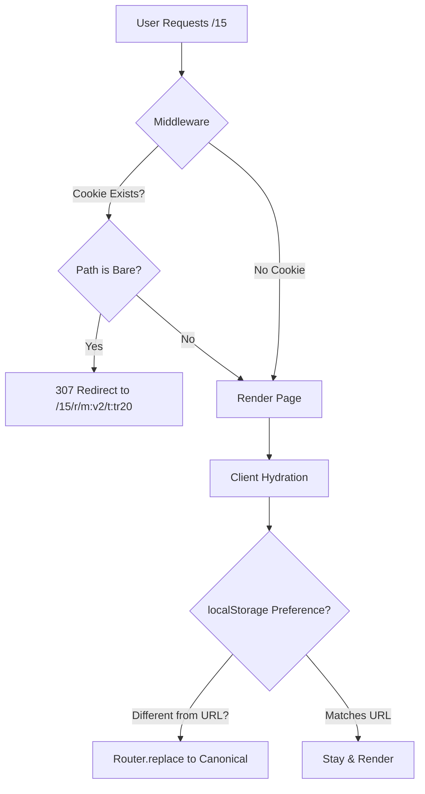
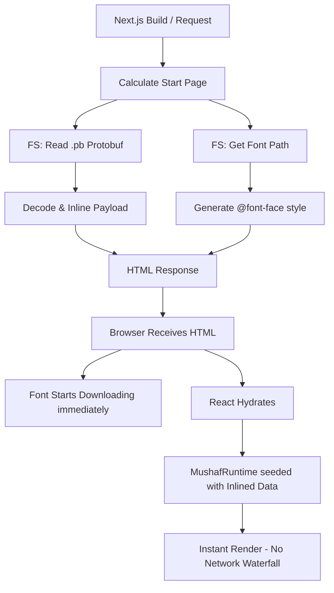
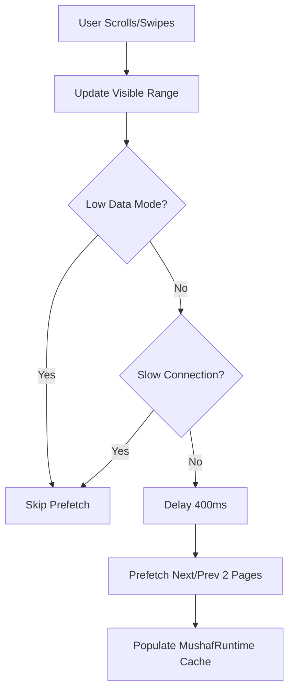

# Quran App

A high-performance, PWA-ready Quran Mushaf reader built with Next.js 16, TypeScript, and Protobuf. Optimized for "practical perfection" in rendering speed, layout stability, and offline capability.

## 🚀 Performance Architecture

### 1. URL Normalization & Redirection
To ensure a zero-flash experience and optimal SEO/Caching, the app enforces canonical URLs based on user preferences.



### 2. Server-Side Data Inlining (SSG/ISR)
Critical Mushaf data and font styles are inlined during the build process to eliminate the "Loading..." state on first paint.



### 3. Preemptive Caching & Network Awareness
The app intelligently prefetches neighboring pages based on scroll direction and network quality.



## 🛠 Features

- **SSG & ISR**: Static Site Generation for all 114 Surahs and 30 Juz.
- **Protobuf Pipeline**: Compact binary payloads for mushaf layouts.
- **PWA**: Installable on mobile/desktop with offline support via Service Workers.
- **Adaptive Modes**:
  - **Low Data Mode**: Disables all background prefetching.
  - **Low Storage Mode**: Reduces memory and font cache budgets (auto-eviction).
- **Redirection Middleware**: Server-side normalization to avoid the "default preference flash".

## 📦 Getting Started

### Prerequisites
- [Bun](https://bun.sh) (Recommended) or Node.js

### Installation
```bash
bun install
```

### Asset Generation
Before running the app, you must sync the Mushaf assets (Fonts, JSON, Protobuf):
```bash
# Sync all variants for all pages
bun run generate:mushaf-assets --codes all --all

# Or sync specific variant/pages
bun run generate:mushaf-assets --codes v2 --pages 1-10
```

### Development
```bash
bun run dev
```

### Build & Production
```bash
bun run build
bun run start
```

## 📜 Documentation

- [Performance Decisions](./docs/perf-decisions.md)
- [Revision Guidelines](./docs/revision-dos.md)
